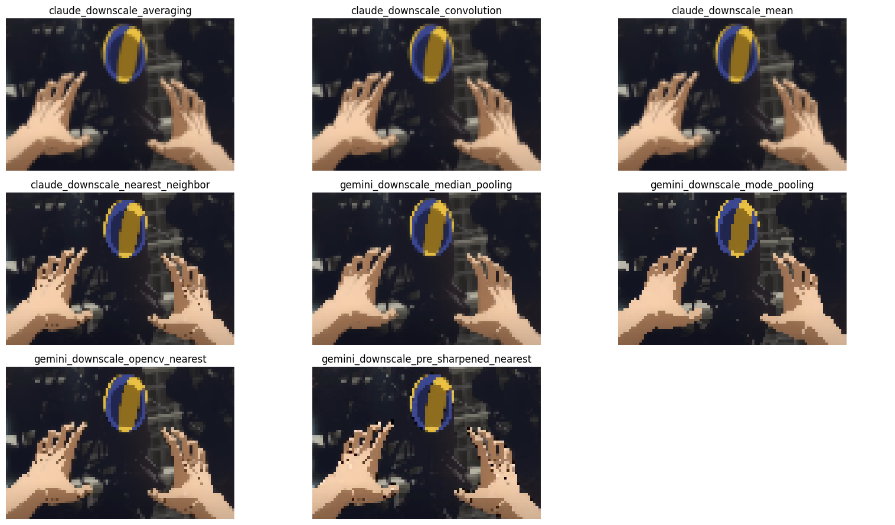
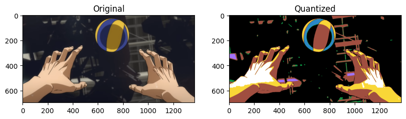
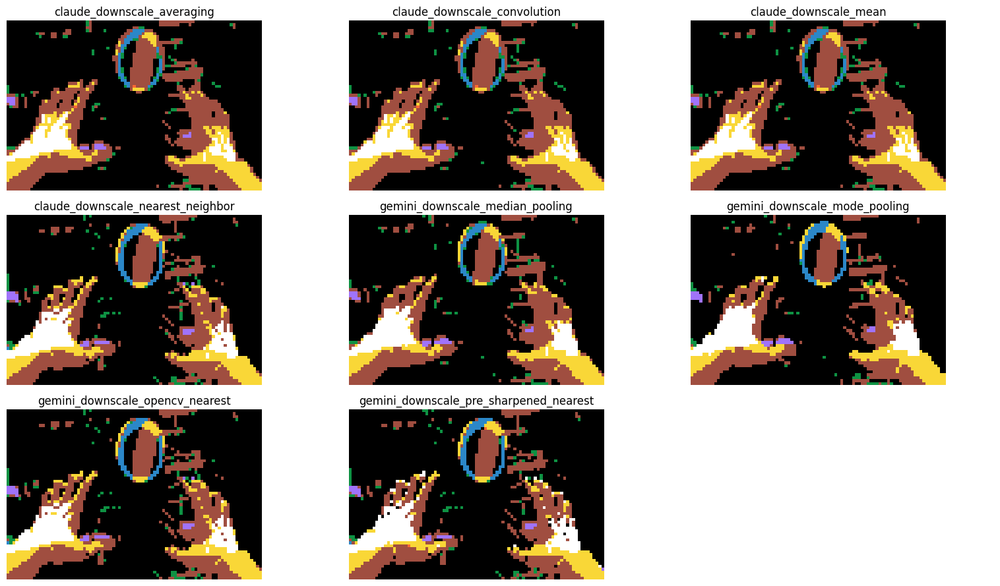
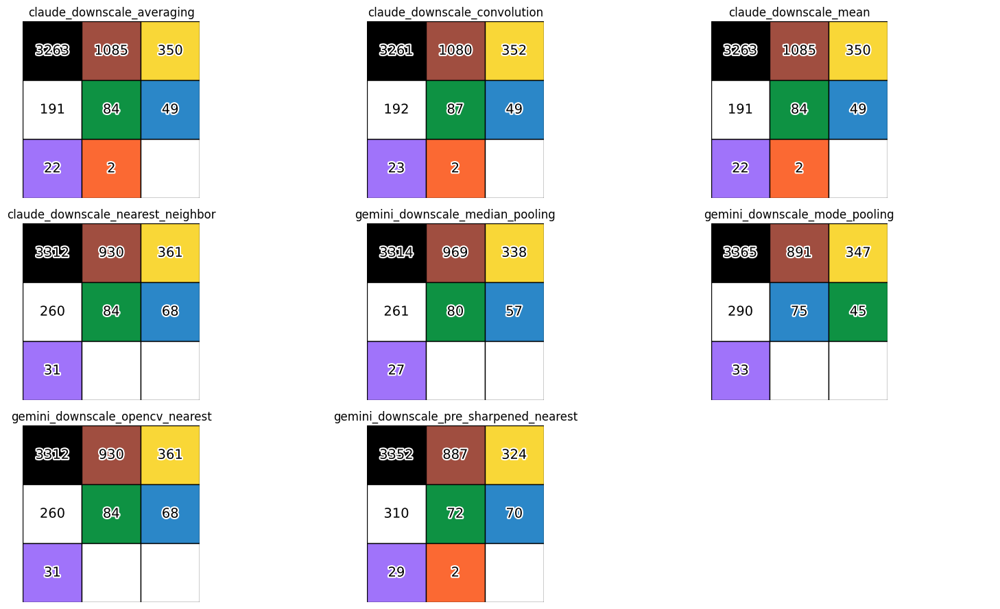

# Pyssla designer

We take an image and transcribe it into pixel art, able to be constructed using the [fuse beads](https://en.wikipedia.org/wiki/Fuse_beads) (a.k.a. Perler beads or [IKEA's PYSSLA beads](https://www.ikea.com/us/en/p/pyssla-beads-mixed-colors-50128572/)).

The notebook `segmenter.ipynb` acts as the pipeline to process the image and the notebook `placer.ipynb` acts to view the 29 x 29 sections of the image close up (to use when placing the beads).

## Resolution

The canvas size is a parameter that can be adjusted based on how large or small to downscale the image. The IKEA set comes with 29 x 29 stencils to place beads, and we use an environment variable called `CANVAS_SIDE` to store this value. By default, the canvas is created to be of size `(CANVAS_SIDE, CANVAS_SIDE)` but this can be adjusted within the notebook.

## Downscaling

We use a variety of methods, suggested by `claude-3-7-sonnet-20250219` and `gemini-2.5-flash`. These methods are recorded in `src/pyssla_designer/downsampling.py`. Below is a comparison of the methods, which you can also compare within the notebook:

## Quantization

To be transcribe the downscaled pixels into colors for the beads, we coin the term *quantization*. The colors of the beads are defined as independent variables, and stored as a list of colors when initialized in the notebooks via the `init_config(canvas_multiplier=<int>)`. For every pixel, we calculate the Euclidean distance between the original pixel and each pixel in the colors, and transcribe to the color with the smallest distance.

The Euclidean distance between the $i$-th pixel and the $j$-th palette color is defined by
$$D_{i,j}=\sqrt{S_{i,j}}=\sqrt{\sum_{k=1}^{3}(p_{ik}-c_{jk})^2}=||p_i-c_j||_2$$

Quantization to the IKEA PYSSLA palette can be seen below:

## Downscaling + Quantization

Both the downscaling and quantization can be seen below:

## Color Counts

We also count the number of beads necessary for each of the downscaling and quantization combinations:

## Notes

We can also perform downscaling for the quantized image, as attempted in `segmenter_reverse.ipynb`, but this yields essentially the same results as the run without quantizing first.

